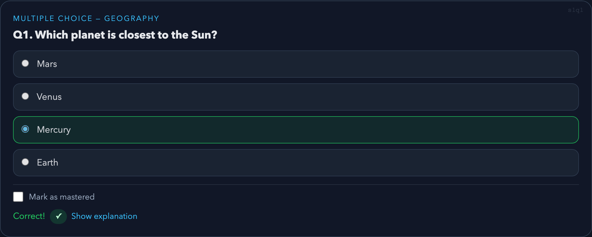
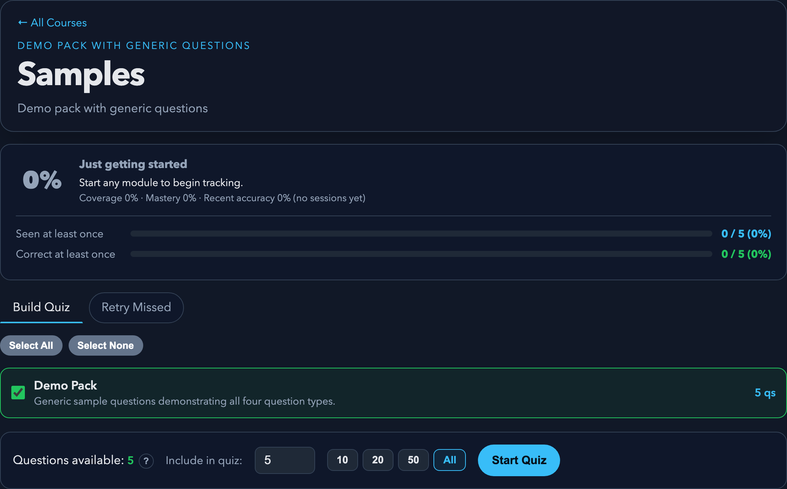

<p align="center">
  
</p>

<h1 align="center">Quizzler</h1>

<p align="center">
  Zero-dependency quiz engine for exam prep — single HTML file + JSON question packs.
</p>

<p align="center">
  
  
  
</p>

<p align="center">
  
  <br>
  
</p>

## Quick Start

```bash
git clone https://github.com/dave-schmidt-dev/quizzler.git
cd quizzler
npm install        # Playwright (for tests only)
./start.sh         # Opens in browser
```

No build step required. The app is a static SPA served by Python's built-in HTTP server. Requires `python3`. The launcher auto-detects your platform for opening the browser (macOS, Linux, or falls back to printing the URL).

`./start.sh` binds to `127.0.0.1` only (loopback — not reachable from other devices). `./start.sh --lan` serves a scoped public directory (`app/` + `question-packs/`, excluding `.git`/`.claude`/`scripts`) on all interfaces so you can study from a phone or tablet on the same Wi-Fi.

## Features

- **4 question types** — multiple choice, true/false, matching, scenario-based
- **Weighted selection** — unseen 10×, seen-but-wrong 5× (info icon explains it on the config screen)
- **Mastery tracking** — mark questions you've nailed; mastered questions drop out of new quizzes until you reset progress
- **Readiness score** — coverage (30%) + mastery (30%) + recent accuracy (40%), with a per-band next-step hint
- **Session history** — 200-session log; expand any row to see prompts, picked vs. correct, and explanations for missed questions
- **Retry missed** — three post-quiz actions: Retry missed, Start another (preserves selections), Back to Course; or replay missed from any past session
- **Randomized order** — questions and answer options shuffled each session
- **Instant feedback** — explanation shown after every answer
- **Quick-pick chips** — set quiz size to 10 / 20 / 50 / All without typing
- **Module grouping** — pack lists group by filename pattern (Original rounds / Chapter packs / Combined exams)
- **Keyboard-first** — every interactive element is reachable by Tab; styled `:focus-visible` outlines throughout
- **Dark theme + flat aesthetic** — no gradients, no blur, honors `prefers-reduced-motion`
- **Offline-capable** — all data stored in localStorage

## Adding a Course

1. Create a folder under `question-packs/` (e.g., `question-packs/my-course/`).
2. Drop a `_course.json` (id, name, description, optional `sort_order`) and one or more pack JSON files following `question-packs/pack-template.json`.
3. Run `./start.sh` (or `python3 scripts/build_manifest.py`) — the manifest is rebuilt from disk and the new course shows up on the home screen.

No code edits to `app/index.html` required. The course list is auto-discovered from the folder layout. See [question-packs/AUTHORING.md](question-packs/AUTHORING.md) for the full authoring guide and schema.

> The live `question-packs/manifest.json` is gitignored — it is regenerated by `start.sh` and by the Playwright `webServer` command in CI (or whenever Playwright starts its own server). If you already have a local server running on the port, Playwright reuses it as-is. See `question-packs/manifest.example.json` for the structure.

## Question-Pack Validation

- **Authoring-time gate**: `scripts/lint_hook.py` (PostToolUse hook) runs when packs are edited and reports findings. Configured in `.claude/settings.json`.
- **Suppress findings**: Add a `lint_waivers` array (top-level in pack JSON) with reasons.
- **Quiet startup**: `scripts/build_manifest.py` prints a one-line summary; full log in `/tmp/quizzler-lint.log`. Use `--verbose` for inline output.
- **Standalone linter**: `python3 scripts/lint_packs.py <pack.json>` or `--all`.
- **Factual critic (Layer C)**: `python3 scripts/factcheck_pack.py <pack.json>` runs an LLM over each question to catch factual errors the deterministic linter cannot see (structure vs. truth). On-demand, probabilistic — verify findings before acting.

See [Validation Rules](docs/VALIDATION_RULES.md) for criteria.

## Testing

```bash
npm test              # Run all Playwright tests
npm run test:headed   # Run with visible browser
```

Tests are course-agnostic and dynamically discover whatever packs are available. The included sample pack is enough to run the full suite out of the box.

## Documentation

- [Architecture](docs/ARCHITECTURE.md) — engine design and feature overview
- [Question Schema](docs/QUESTION_SCHEMA.md) — JSON pack format
- [Question Types](docs/QUESTION_TYPES.md) — when to use each type
- [Validation Rules](docs/VALIDATION_RULES.md) — 6-tier validation
- [Authoring Guide](docs/AUTHORING_GUIDE.md) — writing quality standards
- [Coverage Model](docs/COVERAGE_MODEL.md) — topic frequency tracking
- [Recent Memory Policy](docs/RECENT_MEMORY_POLICY.md) — 3-round repetition window

## License

[MIT](LICENSE)
