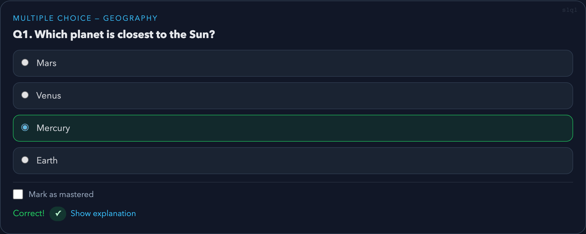
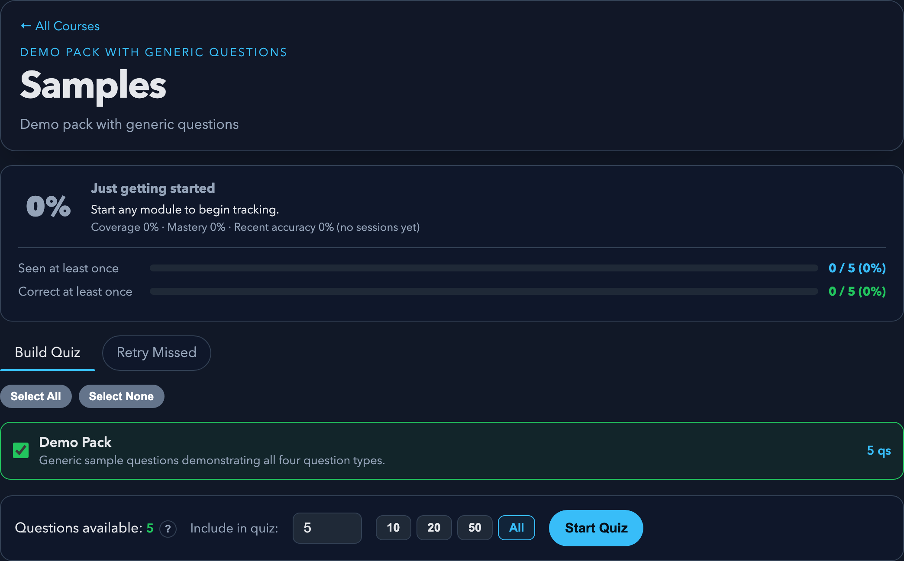

<p align="center">
  
</p>

<h1 align="center">Quizzler</h1>

<p align="center">
  Zero-dependency quiz engine for exam prep — single HTML file + JSON question packs.
</p>

<p align="center">
  
  
  
</p>

<p align="center">
  
  <br>
  
</p>

## Quick Start

```bash
git clone https://github.com/dave-schmidt-dev/quizzler.git
cd quizzler
npm install        # Playwright (for tests only)
./start.sh         # Opens in browser
```

No build step required. The app is a static SPA served by Python's built-in HTTP server. Requires `python3`. The launcher auto-detects your platform for opening the browser (macOS, Linux, or falls back to printing the URL).

### Launch Matrix

| Command | Scope | Browser Opens | Progress Store |
|---|---|---|---|
| `./start.sh` | all IPv4 interfaces (LAN) | `/app/` | browser localStorage |
| `./start.sh --no-lan` | loopback only | `/app/` | browser localStorage |
| `./start.sh --tailscale` | loopback + Tailscale IP | `/app/` | browser localStorage |
| `./start.sh --shared-progress` | all IPv4 interfaces (LAN) | `/pair` | browser localStorage until paired |
| `./start.sh --shared-progress --no-lan` | loopback only | `/pair` | browser localStorage until paired |
| `./start.sh --shared-progress --tailscale` | loopback + Tailscale IP | `/pair` | browser localStorage until paired |

LAN is the default; use `--no-lan` for loopback-only. Note what LAN mode does and does not protect: pairing gates progress *mutations*, but the app, the manifest, and every question pack are served **unauthenticated** to anyone on the same network. That is fine on a trusted home Wi-Fi and is the reason `--no-lan` exists for anywhere else.

`--tailscale` binds to loopback plus the discovered Tailscale IPv4 address. Pass `--lan` explicitly with `--tailscale` to retain the all-interface LAN bind.

The server **always** has shared-progress endpoints available — `--shared-progress` only controls whether the browser opens to `/pair` instead of `/app/`. Switch between local and shared progress at any time from the Settings panel (gear icon on the home screen) — no restart required.

### Settings Panel

A gear icon in the upper-right of the home screen opens Settings, which shows the current storage mode (local or server-backed). From here you can enable or disable shared progress, view server info, and pair with new devices. The panel also surfaces an expired-session banner with a direct path back to Settings for re-pairing.

### Shared Progress (Cross-Device Sync)

Server-authoritative persistence so multiple browsers share one progress store — study on a Mac and pick up on a phone with synced history, mastery, and SRS state.

**Pairing flow:**
1. Run `./start.sh --shared-progress` (add `--no-lan` for loopback-only or `--tailscale` for Tailscale).
2. On the Mac, the browser opens to `/pair` — click "Generate pairing code" to get a 4-digit code.
3. Click "Pair this device" to auto-pair the local browser; this does not consume the code.
4. On the phone/tablet, open `http://<ip>:4123/app/` — a boot-time pairing gate appears asking for the 4-digit code (or tap "Use Local Storage" to skip).
5. Enter the code from the Mac. The code is single-use, so generate a new code before pairing another remote device. Both devices now sync to the same SQLite store.

You can also enable shared progress without restarting: open Settings on an already-running app and the server is auto-detected. Switching back to local storage logs out and reverts to localStorage — server data is preserved.

**Data paths:**
- Database: `.data/quizzler.sqlite3`
- Logs: `.logs/quizzler.log`
- Backup: `.data/quizzler.sqlite3.backup` (before schema migrations)

**Recovery:** If a quiz-completion save fails (network blip), the browser offers a JSON download of the lost session. Re-import via the Extras tab (Import Progress Data).

**Stop:** Press Enter or Ctrl+C in `start.sh` — the server is cleanly killed (trap handler).

**Offline:** Default (non-shared) mode is fully offline-capable with localStorage. Shared-progress mode requires network access to the server on port 4123.

## Features

- **5 question types** — multiple choice, multiple select (choose all that apply), true/false, matching, scenario-based
- **Spaced repetition** — a separate SRS review mode with a 7-tier interval ladder (1, 3, 7, 14, 30, 60, 120 days) and a due-today queue, built for short sessions on a phone. Independent of mastery: rating a question in SRS never changes its mastery state, and marking a question mastered never removes it from SRS review
- **Weighted selection** — unseen 10×, seen-but-wrong 5× (info icon explains it on the config screen)
- **Mastery tracking** — mark questions you've nailed; mastered questions drop out of new quizzes until you reset progress
- **Readiness score** — coverage (30%) + mastery (30%) + recent accuracy (40%), with a per-band next-step hint
- **Session history** — 200-session log; expand any row to see prompts, picked vs. correct, and explanations for missed questions
- **Retry missed** — three post-quiz actions: Retry missed, Start another (preserves selections), Back to Course; or replay missed from any past session
- **Randomized order** — questions and answer options shuffled each session
- **Instant feedback** — explanation shown after every answer
- **Quick-pick chips** — set quiz size to 10 / 20 / 50 / All without typing
- **Module grouping** — pack lists group by filename pattern (Original rounds / Chapter packs / Combined exams)
- **Keyboard-first** — every interactive element is reachable by Tab; styled `:focus-visible` outlines throughout
- **Dark theme + flat aesthetic** — no gradients, no blur, honors `prefers-reduced-motion`
- **Offline-capable** — all data stored in localStorage

## Adding a Course

1. Create a folder under `question-packs/` (e.g., `question-packs/my-course/`).
2. Drop a `_course.json` (id, name, description, optional `sort_order` and `question_budget.target`) and one or more pack JSON files following `question-packs/pack-template.json`.
3. Run `./start.sh` (or `python3 scripts/build_manifest.py`) — the manifest is rebuilt from disk and the new course shows up on the home screen.

Course sizing is gated at build time: over 200 questions is an advisory planning signal; over 240 blocks installation. A course budget cannot raise the hard ceiling, which keeps exam banks from growing into unnecessary 400–500-question collections. Strict builds also reject critical pack findings, malformed course metadata, and course-level area distributions outside the published-weight band. The explicit `--allow-course-size-preview` and `--no-strict` options are for local WIP preview only; ordinary `start.sh`, CI, and shipping paths remain strict.

No code edits to `app/index.html` required. The course list is auto-discovered from the folder layout. See [question-packs/AUTHORING.md](question-packs/AUTHORING.md) for the full authoring guide and schema.

> The live `question-packs/manifest.json` is gitignored — it is regenerated by `start.sh` and whenever Playwright starts its own server for the test suite. Playwright does not reuse an already-running server, so the manifest is rebuilt before browser tests. See `question-packs/manifest.example.json` for the structure.

## Question-Pack Validation

Pack quality is enforced at multiple boundaries (**INV-7** — see `INVARIANTS.md`):

- **Coverage blueprint (L23):** every installed pack must declare
  `coverage_blueprint`; missing blueprint or under-covered topics are CRITICAL.
- **Published course areas (L27):** course metadata must be a readable JSON
  object; questions must name declared `exam_area` values; `exam_objectives`
  sources require an absolute HTTPS URL and reviewer/date attestation. Strict
  builds compare surviving course question shares with published area weights.
- **Authoring-time gate**: staged pack lint and native SwiftLint/Periphery checks
  run at commit through `.githooks/pre-commit`; no editor or post-tool hook is
  installed.
  Periphery retains Codable members consumed by serialization and the two exact
  DEBUG launch-environment hook files; remaining findings stay visible to the
  strict scan rather than being report-excluded.
- **Readiness campaign + certification**: use `scripts/certification_campaign.py`
  to freeze review evidence, batch remediation, and track targeted rechecks.
  It never certifies. The configured high-capability verifier supplies the one
  full frozen-snapshot census; DeepSeek Flash Go is advisory. After exact
  changed-ID rechecks, `hybrid_verify.py --certify-campaign <ledger>` writes the
  stamp with deterministic checks and no fresh LLM call. `verify_pack.py` is an
  internal library primitive and its direct shell CLI is retired. See [Validation
  Rules](docs/VALIDATION_RULES.md).
- **Retired direct routes**: `verify_pack.py` operator certification and
  `--panel` certification are no longer supported. The direct command fails
  fast with guidance to `hybrid_verify.py`; non-certifying factcheck and critic
  tools remain available for authoring-time review.
- **No local self-certification.** There is no bypass for "external reviewer
  capacity unavailable". The former `certify_codex_review.py` /
  `codex-local-semantic-review` path is deleted: it wrote a certification from
  inside the same session that authored the pack, which let `sy0-701` ship 115
  criticals while the install gate reported a clean pass. A pack reviewed only by
  its own author is not certified, whatever flags were passed.
- **Git hooks** (`.githooks/`, install via `./scripts/hooks/install.sh`):
  pre-commit lints staged packs and native Swift sources/dead code; pre-push
  runs the native aggregate gate and `npm test`. No post-tool hook is used.
  If a hook message suggests rerunning `hybrid_verify.py <pack>` directly,
  use the evidence-final campaign workflow in [Validation Rules](docs/VALIDATION_RULES.md)
  instead; live reviewer runs never stamp a pack.
- **Suppress findings**: Add a `lint_waivers` array (top-level in pack JSON) with
  reasons. Do not waive L23 on installed packs.
- **Quiet startup**: `scripts/build_manifest.py` prints a one-line summary; full log
  in `/tmp/quizzler-lint.log`. Use `--verbose` for inline output. Strict by default
  (Layer-A criticals abort the affected course). Exit 2 means a partial install
  with failing courses excluded; exit 1 means no manifest was written. The
  `QUIZZLER_LINT_STRICT=0` / `--no-strict` bypass is for **local WIP preview only**.
- **Standalone linter**: `python3 scripts/lint_packs.py <pack.json>` or `--all`.
- **Factual critic (Layer C)**: `python3 scripts/factcheck_pack.py <pack.json>`
  runs an LLM over each question to catch factual errors the deterministic linter
  cannot see (structure vs. truth). On-demand, probabilistic — verify findings
  before acting. `--provider` selects the backend (`claude`, `codex`, `opencode`, or any
  OpenAI-compatible endpoint); `scripts/critic_panel.py` runs several at once
  and merges their findings. Neither script certifies anything — certification
  is `hybrid_verify.py`'s job alone.
- **Evidence-final certification campaign**: freeze a snapshot, run one full
  high-capability-verifier census, and retain DeepSeek as advisory evidence.
  Resolve the recorded blockers in one remediation batch, then run exact
  changed-ID rechecks. When the ledger is complete, run
  `python3 scripts/hybrid_verify.py <pack> --certify-campaign <ledger>`.
  This deterministic stamp route checks the snapshot, evidence, and Layer-A
  structure and makes no fresh reviewer/LLM call. New concerns belong to the
  next campaign; they do not reopen this frozen campaign. See [Critic
  Providers](docs/CRITIC_PROVIDERS.md).
- **Course-wide re-certification**: a schema or critic-contract bump requires an
  evidence-final campaign for each affected pack. The legacy
  `scripts/recert_sweep.py` live-stamping route is retired and fails closed; use
  frozen discovery evidence plus `hybrid_verify.py --certify-campaign <ledger>`.

See [Validation Rules](docs/VALIDATION_RULES.md) for criteria.

## Testing

```bash
npm test              # Full gate: Playwright (both configs) + Python unittests
npm run test:python   # Python suites only
npm run test:shared   # Shared-progress Playwright config only
npm run test:headed   # Playwright with a visible browser
```

When recording the authoritative gate, preserve npm's exit status instead of
tail's: `npm test > /tmp/quizzler-test.log 2>&1; echo rc=$?`.

`npm test` is the whole gate, not just the browser suite: it runs the default Playwright config, then the shared-progress config (which spawns a real server), then 18 Python unittest modules covering the pack linter, manifest builder, certification gate, and HTTP server. All three must pass.

Tests are course-agnostic and dynamically discover whatever packs are available. The included sample pack is enough to run the full suite out of the box.

> A piped invocation reports the exit code of the last command in the pipe, not the suite — `npm test | tail` has read red as green here more than once. Use `npm test > gate.log 2>&1; echo "rc=$?"`.

### VM profile-free test configuration

The switchyard macOS VM lane runs this project's Xcode tests inside a guest that
has no Apple Development identity, no team membership, and no provisioning
profile. `scripts/vm-test-build.sh` is the entry point:

```bash
scripts/vm-test-build.sh            # defaults to the Quizzler scheme
```

This project needs **no signing overrides** to build that way. Every target in
`app/project.yml` is `platform: iOS`, so every test destination is a simulator,
and Xcode already signs simulator products ad-hoc and strips their entitlements —
a bare `build-for-testing` is profile-free on its own, despite `QuizzleriOS`
carrying `CODE_SIGN_STYLE: Manual` and a project-wide `DEVELOPMENT_TEAM`. The
script builds bare and then asserts the property, because the assertion is what
catches a target regaining a team on the host rather than in the guest twenty
minutes later. `QuizzleriOS.Debug.entitlements` is unchanged; device and
TestFlight builds keep their full signing contract.

There is deliberately **no `VMProfileFreeTest` build configuration**. An earlier
attempt added one by hand to `app/Quizzler.xcodeproj/project.pbxproj`; the next
`xcodegen generate` erased it, and the README kept describing it for two days. A
script that passes settings on the command line survives regeneration, and a third
configuration would propagate through every target and SPM dependency to buy
nothing this project needs.

Note the ad-hoc requirement is still real for anything that *does* run natively in
the guest: `CODE_SIGNING_ALLOWED=NO` produces an unsigned Mach-O that AMFI
SIGKILLs at `exec` on Apple silicon, which xcodebuild reports as `Test crashed
with signal kill before establishing connection`.

**Capabilities unavailable under this configuration.** Simulator builds carry an
empty entitlements dictionary, so tests needing any of these must run on a real
device against a real profile:

| Capability | Entitlement | Effect in the VM |
|---|---|---|
| CloudKit | `com.apple.developer.icloud-services`, `com.apple.developer.icloud-container-identifiers` | No `iCloud.com.zerodelta.quizzler.dev` container access; cross-device progress sync cannot be exercised |
| Push notifications | `aps-environment` | No APNs registration; remote-notification paths are unreachable |

`QuizzlerSnapshotTests` and the pack/linter suites are unaffected — they are
deterministic and never touch either capability.

## Apple release status

The native iOS foundation is implemented in `app/` and its contract/test gates
are part of this repository. The native plan was re-baselined on 2026-08-14:
Phase 1 is complete; Phases 2–4 have implementation but no phase-gate closeout;
Phases 5–6 remain pending. The approved `new_start` decision applies only to
existing quiz-progress migration, not to the native plan. Candidate 17 is
release-tooling-only: its TestFlight upload was not completed and is not claimed
here.

The v2 release flow begins with `app/prepare-testflight-candidate`, which
freezes the committed, clean `app/` source identity and creates only a local
readiness skeleton. It never contacts Apple or reads credentials. After the
signed IPA, Production CloudKit snapshot, and two physical-device observations
are bound to that exact candidate, run `app/deploy-testflight --attended`.
`app/release-status` and `app/release-testflight` are retired fail-closed
paths; they cannot create or upload a candidate. The native iOS / CloudKit /
TestFlight work remains governed by its existing project plan.
The repository's pre-push hook runs the native aggregate gate and the web-project
`npm test` gate; it is not an Apple release gate.

### Native question content

The iOS app ships no questions of its own. A `Bundle question packs` build phase
runs `scripts/build_pack_assets.py`, which discovers the packs installed under
`question-packs/`, checks each against the native metadata contract (lint L29),
copies them into the app bundle, and writes `question-assets.json` with a
`sha256:` content digest per pack. `PackCatalog` in QuizzlerKit reads that
manifest at launch and verifies every pack against its recorded digest before
any question reaches a screen. A pack the decoder would refuse fails the build;
a build with no installable pack fails outright (`--require-pack`).

Two consequences worth knowing before you build a candidate:

- `question-packs/*/` is gitignored except `samples/`, so **the build bundles
  whatever is installed on the machine doing the building**. A clean checkout
  produces an app containing only the sample pack. The digests in
  `question-assets.json` are what make a given build self-describing about the
  content it carries.
- When nothing loads, the app shows an explicit empty state naming the reason.
  It never falls back to built-in questions — see INV-12.

The 2026-08-13 Phase 1 recheck is historical. On 2026-08-19, the exact signed
Development private-zone probe completed on the paired iPad, and the signed
Debug build installed and launched on both the paired iPad and iPhone. The
full `npm test` suite passed (342 Playwright, 38 shared, and 1,002 Python
tests). A current contract-gate invocation requires the attended signed-probe
environment and was not claimed as green by this documentation update. These
checks do not establish INV-8, CloudKit Production, or TestFlight readiness.

## Documentation

- [Architecture](docs/ARCHITECTURE.md) — engine design and feature overview
- [Question Schema](docs/QUESTION_SCHEMA.md) — JSON pack format
- [Question Types](docs/QUESTION_TYPES.md) — when to use each type
- [Validation Rules](docs/VALIDATION_RULES.md) — the full rule set: Levels 1–6 (schema, answer integrity, visual, pedagogical, repetition, coverage) plus the L1–L27 cue/leak linter, waivers, and the pack-readiness gate
- [Critic Providers](docs/CRITIC_PROVIDERS.md) — multi-provider Layer-C panel, secret handling
- [Authoring Guide](docs/AUTHORING_GUIDE.md) — writing quality standards
- [Report Schema](docs/REPORT_SCHEMA.md) — session results, mastery, and SRS state, shared by both storage modes
- [Native Architecture](docs/NATIVE_ARCHITECTURE.md) — SwiftUI, local progress, and CloudKit qualification boundaries
- [Progress Protocol](docs/PROGRESS_PROTOCOL.md) — browser/native progress compatibility contract
- [Progress Migration](docs/PROGRESS_MIGRATION.md) — source inventory and explicit migration decisions
- [Apple Setup Checklist](app/APPLE_SETUP_CHECKLIST.md) — attended Apple account and CloudKit prerequisites
- [Release Checklist](app/RELEASE_CHECKLIST.md) and [Promotion](app/PROMOTION.md) — candidate and TestFlight procedures
- [SRS Mode Decisions](docs/SRS_MODE_DECISIONS.md) — why spaced repetition is a separate mode
- [Generation Prompt Template](docs/GENERATION_PROMPT_TEMPLATE.md) — prompt scaffold for LLM-authored packs
- [Coverage Model](docs/COVERAGE_MODEL.md) — topic frequency tracking
- [Course Build Playbook](docs/COURSE_BUILD_PLAYBOOK.md) — building a whole course via parallel per-chapter agents, mechanical trim, elevated QA
- [Recent Memory Policy](docs/RECENT_MEMORY_POLICY.md) — 3-round repetition window

## License

[MIT](LICENSE)
