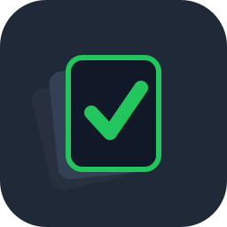

<p align="center">
  
</p>

<h1 align="center">Quizzler</h1>

<p align="center">
  Native exam-prep study for iPhone, iPad, and Mac Catalyst — validated question packs, offline study, and private CloudKit sync.
</p>

<p align="center">
  
  
</p>

## Quick Start

Quizzler is the native SwiftUI app in `app/`. Open `app/Quizzler.xcodeproj` in Xcode to run an iPhone or Mac Catalyst build. The Mac Debug installer and Xcode build wrapper are maintained in this repository:

```bash
python3 app/scripts/install_mac_app.py
```

The installer builds a Debug Mac Catalyst app, verifies its signature and iCloud container, then installs it through the project-owned workflow. For iOS, select an iPhone simulator or the paired device from Xcode. CloudKit synchronization requires the configured Apple development environment; study and local progress remain available offline.

### Question reports (native app)

In-app question reports submitted on iPhone/iPad sync through the user's private CloudKit database to the Mac Catalyst app, where an ingest script files them for review. For now this works between Debug builds only (CloudKit Development); TestFlight builds are not wired up yet.

1. Report an issue from the question screen on iPhone/iPad (saved locally and sent to private CloudKit with the next sync).
2. Open Quizzler on the Mac or press Settings > Question reports > Check now (writes `~/Library/Application Support/Quizzler/issue-inbox-v1.json`).
3. Run `python3 scripts/ingest_issue_reports.py` to file each report.

Flags: `--dry-run` (report what would be filed, write nothing), `--summary` (grouped view by course, pack, question on stdout), `--source PATH` (repeatable; default is the Mac app's file and its sandbox-container equivalent), and `--debug`.

Entries are headed `` ### <date> — `<question id>` — source: in-app report, pack `<pack id>`, issue `<issue id>` `` and appended to `.logs/feedback/<course>/pending.md` (course from `question-packs/<course>/_course.json`, otherwise `.logs/feedback/_unrouted/pending.md`), tracked by `.logs/feedback/.ingested-issues.json` so a re-run adds nothing.

Xcode calls owned by this checkout use `app/scripts/xcb <xcodebuild arguments>`. Builds share one ignored `.build/DerivedData` cache per worktree; the wrapper locks `.build/xcodebuild.lock` so concurrent builds in that worktree run in sequence and reports progress while waiting or building. The wrapper keeps Xcode output visible, and the Mac installer writes `.logs/mac-install.log`.

Install the Mac app with `python3 app/scripts/install_mac_app.py` (never copy a build into `/Applications` by hand). It builds the Debug Mac Catalyst app, verifies its signature and iCloud container, quits running copies, swaps it into `/Applications/Quizzler.app` with rollback on failure, prunes stale legacy Mac builds under `app/build` (TestFlight archives are never touched), unregisters every other LaunchServices registration for `com.zerodelta.quizzler`, and fails unless the identifier then resolves only to the installed app. It refuses, and names the path, when another bundle in `/Applications` claims the identifier, including a wrapped TestFlight/App Store install; move that one to the Trash yourself. Progress is on stderr as `install.<step>` lines, ending with `install.complete ... commit=<git describe>`. `--skip-build` reinstalls the last build; `--destination DIR` installs elsewhere.

## Features

- **Pack-backed study** — validated question packs are bundled into the native app and decoded before study.
- **Spaced repetition** — a separate SRS review mode with a 7-tier interval ladder (1, 3, 7, 14, 30, 60, 120 days) and a due-today queue, built for short sessions on a phone. Independent of mastery: rating a question in SRS never changes its mastery state, and marking a question mastered never removes it from SRS review
- **Pack-scoped progress** — question identity, mastery, scheduled reviews, and history stay tied to the source course and pack.
- **Private CloudKit sync** — native devices exchange versioned progress with visible recovery and conflict states.
- **CS0-004 synthetic investigation** — a native supplemental case appears only on the selected CySA+ course's Today screen and teaches evidence reading and handoff practice. It is explicitly not exam readiness and does not add built-in quiz questions or affect pack progress.

## Adding a Course

Follow the [Study Delivery Policy](docs/STUDY_DELIVERY_POLICY.md): target 20–30 independently checked questions for the next needed topic before whole-course expansion. Scoped private-study installation (via quarantine and Debug `--allow-partial`) and cross-campaign evidence reuse (via receipt-bound inheritance) are supported under strict quality gates. The [Course Build Playbook](docs/COURSE_BUILD_PLAYBOOK.md) covers expansion and release.

1. Create a folder under `question-packs/` (e.g., `question-packs/my-course/`).
2. Drop a `_course.json` (id, name, description, optional `sort_order` and `question_budget.target`) and one or more pack JSON files following `question-packs/pack-template.json`.
3. Run `python3 scripts/build_manifest.py`, then build the native app with Xcode — the build validates and bundles installable packs.

Course sizing is gated at build time: over 200 questions is an advisory planning signal; over 240 blocks installation. A course budget cannot raise the hard ceiling, which keeps exam banks from growing into unnecessary 400–500-question collections. Strict builds also reject critical pack findings, malformed course metadata, and course-level area distributions outside the published-weight band. The explicit `--allow-course-size-preview` and `--no-strict` options are for local inspection only; CI and native app builds remain strict.

See [question-packs/AUTHORING.md](question-packs/AUTHORING.md) for the pack authoring guide and schema. Installed course folders are local-only; the native build uses the packs present on that machine.

## Question-Pack Validation

Pack quality is enforced at multiple boundaries (**INV-7** — see `INVARIANTS.md`):

- **Coverage blueprint (L23/L30):** every installed pack must declare
  `coverage_blueprint`; published-objective courses may key it by official
  objective id. Missing, under-covered, or undeclared objectives are CRITICAL.
- **Published course areas (L27):** course metadata must be a readable JSON
  object; questions must name declared `exam_area` values; `exam_objectives`
  sources require an absolute HTTPS URL and reviewer/date attestation. Strict
  builds compare surviving course question shares with published area weights.
- **Published objectives (L30):** when `_course.json` transcribes numbered
  objectives, every question and blueprint requirement must resolve to one of
  them, and every declared objective must be represented.
- **Authoring-time gate**: staged pack lint and native SwiftLint/Periphery checks
  run at commit through `.githooks/pre-commit`; no editor or post-tool hook is
  installed.
  Periphery retains Codable members consumed by serialization and the two exact
  DEBUG launch-environment hook files; remaining findings stay visible to the
  strict scan rather than being report-excluded.
- **Readiness campaign + certification**: use `scripts/certification_campaign.py`
  to freeze review evidence, batch remediation, and track targeted rechecks.
  It never certifies. The configured high-capability verifier supplies the one
  full frozen-snapshot census; the roster-resolved advisory route is advisory. After exact
  changed-ID rechecks, `hybrid_verify.py --certify-campaign <ledger>` writes the
  stamp with deterministic checks and no fresh LLM call. `verify_pack.py` is an
  internal library primitive and its direct shell CLI is retired. See [Validation
  Rules](docs/VALIDATION_RULES.md).
- **Retired direct routes**: `verify_pack.py` operator certification and
  `--panel` certification are no longer supported. The direct command fails
  fast with guidance to `hybrid_verify.py`; non-certifying factcheck and critic
  tools remain available for authoring-time review.
- **No local self-certification.** There is no bypass for "external reviewer
  capacity unavailable". The former `certify_codex_review.py` /
  `codex-local-semantic-review` path is deleted: it wrote a certification from
  inside the same session that authored the pack, which let `sy0-701` ship 115
  criticals while the install gate reported a clean pass. A pack reviewed only by
  its own author is not certified, whatever flags were passed.
- **Git hooks** (`.githooks/`, install via `./scripts/hooks/install.sh`):
  pre-commit lints staged packs and native Swift sources/dead code, and also enforces the
  target 500 lines: commits warn above 500 and fail above 800 unless
  `.file-size-exceptions` lists the file with a reason; pre-push runs the
  headless native gates (the aggregate gate and `--phase native`) and
  `npm test`. No hook runs a UI test or checks a UI receipt (**INV-14**). No
  post-tool hook is used.
  If a hook message suggests rerunning `hybrid_verify.py <pack>` directly,
  use the evidence-final campaign workflow in [Validation Rules](docs/VALIDATION_RULES.md)
  instead; live reviewer runs never stamp a pack.
- **Suppress findings**: Add a `lint_waivers` array (top-level in pack JSON) with
  reasons. Do not waive L23 on installed packs.
- **Quiet startup**: `scripts/build_manifest.py` prints a one-line summary; full log
  in `.logs/quizzler-lint.log`. Use `--verbose` for inline output. Strict by default
  (Layer-A criticals abort the affected course). Exit 2 means a partial install
  with failing courses excluded; exit 1 means no manifest was written. The
  `QUIZZLER_LINT_STRICT=0` / `--no-strict` bypass is for **local WIP preview only**.
- **Standalone linter**: `python3 scripts/lint_packs.py <pack.json>` or `--all`.
- **Factual critic (Layer C)**: `python3 scripts/factcheck_pack.py <pack.json>`
  runs an LLM over each question to catch factual errors the deterministic linter
  cannot see (structure vs. truth). On-demand, probabilistic — verify findings
  before acting. `--provider` selects the backend (`claude`, `codex`, `opencode`, or any
  OpenAI-compatible endpoint); `scripts/critic_panel.py` runs several at once
  and merges their findings. Neither script certifies anything — certification
  is `hybrid_verify.py`'s job alone.
- **Evidence-final certification campaign**: freeze a snapshot, run one full
  high-capability-verifier census, and retain the roster-resolved advisory route as advisory evidence.
  Resolve the recorded blockers in one remediation batch, then run exact
  changed-ID rechecks. When the ledger is complete, run
  `python3 scripts/hybrid_verify.py <pack> --certify-campaign <ledger>`.
  This deterministic stamp route checks the snapshot, evidence, and Layer-A
  structure and makes no fresh reviewer/LLM call. New concerns belong to the
  next campaign; they do not reopen this frozen campaign. See [Critic
  Providers](docs/CRITIC_PROVIDERS.md).
- **Course-wide re-certification**: a schema or critic-contract bump requires an
  evidence-final campaign for each affected pack. The former live-stamping
  recert sweep is deleted; use frozen discovery evidence plus
  `hybrid_verify.py --certify-campaign <ledger>`.
- **Quarantine and partial install**:
  ```bash
  python3 scripts/pack_quarantine.py quarantine --pack P --qid X --reason "..."
  python3 scripts/certification_campaign.py begin-quarantine --ledger L --pack P
  python3 scripts/hybrid_verify.py P --certify-campaign L
  # to restore:
  python3 scripts/pack_quarantine.py restore --pack P
  python3 scripts/certification_campaign.py release-quarantine --ledger L
  ```
  Sets aside questions in a sidecar (`question-packs/<course>/_quarantine/<pack>.json`)
  and writes a top-level `partial_install` marker. The reduced frontier must be
  re-certified. Partial packs install only in Debug builds (`--allow-partial`);
  Release builds refuse them. The app labels the pack `"Partial: N of M reviewed
  questions installed; K held for review"`. Progress for held questions is kept
  in the store and returns on restore.
- **Cross-campaign evidence inheritance**:
  ```bash
  python3 scripts/certification_campaign.py init P --ledger L --inherit-from-ledger PRIOR_L
  ```
  Depth 1 only. Inherits clean census evidence from a prior v2 campaign that
  carries an issuance receipt matching its frontier, when all frozen non-question
  inputs match. Uncovered questions (added, edited, or missing stamps) are routed
  to a tool-computed `inheritance-recheck` round. Quarantined or previously
  inherited priors cannot be inherited.

See [Validation Rules](docs/VALIDATION_RULES.md) for criteria.

## Testing

```bash
npm test
app/test-gate.sh
app/test-gate.sh --phase native   # headless: QuizzlerKitTests, QuizzleriOSTests, QuizzlerSnapshotTests
```

The Python suite covers pack authoring, validation, certification, and build tooling. The native gate covers the Swift packages, app, and Xcode targets. Preserve each command's exit code when saving gate evidence; do not treat a log tail as the command result.

These commands are headless and are what day-to-day work, phase gates, and the
git hooks run. Screen-seizing verification (XCUITest, including iOS Simulator UI
tests; UI automation; screen capture; and any receipt that proves such a run) is
**milestone-only** (**INV-14**): run it before a release candidate, an install
for owner qualification, or a walkthrough, never per phase, commit, or push.

```bash
app/test-gate.sh --phase ui              # milestone only: QuizzleriOSUITests journeys
app/test-gate.sh --quick accessibility   # milestone only: XCUITest accessibility samples (+ optional receipt)
bash scripts/mac_milestone_ui_tests.sh   # milestone only: Mac Catalyst UI journeys (MacCatalystUITests)
bash scripts/review_captures.sh          # milestone only: review screenshots (ReviewCaptureUITests)
```

Keep that suite small (launch, quit, one or two end-to-end journeys). A UI test
that only checks model or view state should become a headless unit, model, or
snapshot test.

### VM profile-free test configuration

The switchyard macOS VM lane runs this project's Xcode tests inside a guest that
has no Apple Development identity, no team membership, and no provisioning
profile. `scripts/vm-test-build.sh` is the entry point:

```bash
scripts/vm-test-build.sh            # defaults to the Quizzler scheme
```

This project needs **no signing overrides** to build that way. Every target in
`app/project.yml` is `platform: iOS`, so every test destination is a simulator,
and Xcode already signs simulator products ad-hoc and strips their entitlements —
a bare `build-for-testing` is profile-free on its own, despite `QuizzleriOS`
carrying `CODE_SIGN_STYLE: Manual` and a project-wide `DEVELOPMENT_TEAM`. The
script builds bare and then asserts the property, because the assertion is what
catches a target regaining a team on the host rather than in the guest twenty
minutes later. `QuizzleriOS.Debug.entitlements` is unchanged; device and
TestFlight builds keep their full signing contract.

Gate-owned simulators are swept and restored automatically; use `bash scripts/with-ui-simulator.sh [purpose] -- command` for disposable ad hoc UI or capture runs, which are milestone-only like the UI phase.

There is deliberately **no `VMProfileFreeTest` build configuration**. An earlier
attempt added one by hand to `app/Quizzler.xcodeproj/project.pbxproj`; the next
`xcodegen generate` erased it, and the README kept describing it for two days. A
script that passes settings on the command line survives regeneration, and a third
configuration would propagate through every target and SPM dependency to buy
nothing this project needs.

Note the ad-hoc requirement is still real for anything that *does* run natively in
the guest: `CODE_SIGNING_ALLOWED=NO` produces an unsigned Mach-O that AMFI
SIGKILLs at `exec` on Apple silicon, which xcodebuild reports as `Test crashed
with signal kill before establishing connection`.

**Capabilities unavailable under this configuration.** Simulator builds carry an
empty entitlements dictionary, so tests needing any of these must run on a real
device against a real profile:

| Capability | Entitlement | Effect in the VM |
|---|---|---|
| CloudKit | `com.apple.developer.icloud-services`, `com.apple.developer.icloud-container-identifiers` | No `iCloud.com.zerodelta.quizzler.dev` container access; cross-device progress sync cannot be exercised |
| Push notifications | `aps-environment` | No APNs registration; remote-notification paths are unreachable |

`QuizzlerSnapshotTests` and the pack/linter suites are unaffected — they are
deterministic and never touch either capability.

## Apple release status

The native iOS and Mac Catalyst foundation is implemented in `app/`; local Mac
Catalyst Debug builds are supported, and its contract/test gates
are part of this repository. All six implementation phases in the current
repository plan are complete locally. That is a source-and-test closeout, not a
deployment claim: this work has not prepared or uploaded a new candidate, and
does not establish App Store Connect processing, tester assignment, installation,
or a TestFlight receipt. Candidate 29 remains the latest documented candidate
walkthrough; the current changes are not bound to that candidate.

The v2 release flow begins with `app/prepare-testflight-candidate`, which
freezes the committed, clean `app/` source identity and creates only a local
readiness skeleton. It never contacts Apple or reads credentials. With the
dated, candidate-current screen walkthrough reviewed by the release owner (the
milestone at which `app/test-gate.sh --phase ui` runs), run
`app/deploy-testflight --attended`; it creates and attests the signed archive/
IPA before the attended upload boundary. The deployment path then verifies
App Store Connect processing, compliance, the Internal Testers group, and the
final TestFlight receipt. Physical-device and CloudKit Production qualification
remain independent attended QA activities, not pre-upload TestFlight gates.
`app/release-status` and `app/release-testflight` are retired fail-closed
paths; they cannot create or upload a candidate. The native iOS / CloudKit /
TestFlight work remains governed by its existing project plan.
`scripts/check_release_temp_hygiene.py -- <test command>` rejects new leaked release fixtures; `scripts/collect_release_temp.py` is a dry-run backlog report, with explicit `--apply` required for safe removal.
The repository's pre-push hook runs the headless native gates and the Python
tooling suite; it is not an Apple release gate and never runs UI tests.

In the native app, Settings > Study stores the default maximum session length
(10, 20, 40, or Whole pack). Today can temporarily choose a different maximum
for its next session. Settings also controls whether scheduled reviews offer
spaced repetition of previously seen questions; turning it off pauses review
prompts without changing saved study history. Retry missed also respects the
session limit and shows how many missed questions fit in the next session.
Settings syncs a maximum Leitner level from 1 to 7 (default 5), using the
1, 3, 7, 14, 30, 60, and 120 day intervals. Correct answers advance one level,
misses drop two, and lowering the limit brings longer review dates forward.
Question and feedback screens show an accessible segmented level pie, interval,
and next due date. View history reads durable per-question review and limit-change
events; older or local-only history is labeled incomplete when it is unavailable.
Cloud sync refuses a single maximum-level reduction that would change more than
248 questions, before changing local progress, and Settings explains the limit.
This keeps the setting, snapshot, and each affected question event in one
atomic CloudKit write.
The first progress write from 1.0.9 upgrades its envelope to schema 2. Older
native builds accept only schema 1 and will show a progress error after that
write; do not roll a device back to 1.0.8 or earlier against upgraded progress.
The Today explanation links to Wikipedia's spaced-repetition overview and
distinguishes due count from the session maximum.
During a question or its feedback, the persistent top row shows `Question X of N`
and session progress; `N` is the number of questions actually selected, which
can be shorter than the chosen maximum. The question's scroll area begins below
that pinned row and returns to the top when the session advances or skips.

The native app shows the shared Zero Delta sting once on a normal cold start.
`app/vendor/ZeroDeltaSting` pins a source copy of the Swift package from
`apple_developer` (provenance in `app/vendor/ZeroDeltaSting/ORIGIN.md`) so this
checkout builds without a sibling repository; XcodeGen references that copy.
The static launch color matches the sting in light and dark appearances, and the
package handles Reduce Motion.

The top status badge reads `Synced` with a green cloud after a successful
iCloud exchange; tapping it checks for updates. Pending or failed sync uses a
red cloud and keeps the available retry action. A sync in progress stays neutral.

### Versioning and iterative test builds

The native app target (`QuizzleriOS`) advances both its marketing version (`MARKETING_VERSION`)
and build number (`CURRENT_PROJECT_VERSION`) with each test iteration across Debug and
Release configurations, incrementing both values together. Settings > About displays
both marketing version and build number directly from the main bundle (`CFBundleShortVersionString`
and `CFBundleVersion`) without stale hardcoded fallbacks. UI tests check the displayed
version/build format without pinning a number that changes with each iteration.

### Native question content

The native app ships no questions of its own. A `Bundle question packs` build phase
runs `scripts/build_pack_assets.py`, which discovers the packs installed under
`question-packs/`, checks each against the native metadata contract (lint L29),
copies them into the app bundle, and writes `question-assets.json` with a
`sha256:` content digest per pack. `PackCatalog` in QuizzlerKit reads that
manifest at launch and verifies every pack against its recorded digest before
any question reaches a screen. A pack the decoder would refuse fails the build;
a build with no installable pack fails outright (`--require-pack`).

Two consequences worth knowing before you build a candidate:

- `question-packs/*/` is gitignored except `samples/`, so **the build bundles
  whatever is installed on the machine doing the building**. A clean checkout
  produces an app containing only the sample pack. The digests in
  `question-assets.json` are what make a given build self-describing about the
  content it carries. Every installed pack must also have fresh INV-8
  certification metadata; `build_pack_assets.py` enforces that at native archive
  time, without a separate candidate-bound release evidence file.
- When nothing loads, the app shows an explicit empty state naming the reason.
  It never falls back to built-in questions — see INV-12.

Historical evidence (2026-08-19, before browser retirement): the signed Debug
build installed and launched on the paired iPad and iPhone, and the signed
Development private-zone probe completed on the iPad. The `npm test` result at
that time included 342 browser tests, 38 shared-progress tests, and 1,002
Python tests; those browser counts do not validate the current native-only
tree. No current build/install result is implied here. These historical checks
do not establish INV-8, CloudKit Production, or TestFlight readiness.

## Conventions

- Decision gates follow the G/A/R autonomy contract: `~/.agent/prompts/_shared/gar.md` (Green = do; Amber = do + ledger; Red = human-only). Never end a turn on a recoverable obstacle.

## Documentation

- [Native Architecture](docs/NATIVE_ARCHITECTURE.md) — SwiftUI, question assets, progress, and CloudKit contracts
- [Question Schema](docs/QUESTION_SCHEMA.md) — JSON pack format
- [Question Types](docs/QUESTION_TYPES.md) — when to use each type
- [Validation Rules](docs/VALIDATION_RULES.md) — the full rule set: Levels 1–6 (schema, answer integrity, visual, pedagogical, repetition, coverage) plus the L1–L27 cue/leak linter, waivers, and the pack-readiness gate
- [Critic Providers](docs/CRITIC_PROVIDERS.md) — multi-provider Layer-C panel, secret handling
- [Authoring Guide](docs/AUTHORING_GUIDE.md) — writing quality standards
- [Report Schema](docs/REPORT_SCHEMA.md) — native progress, issue reports, and historical import shapes
- [Progress Protocol](docs/PROGRESS_PROTOCOL.md) — native CloudKit progress envelope and recovery rules
- [Progress Migration](docs/PROGRESS_MIGRATION.md) — source inventory and explicit migration decisions
- [Apple Setup Checklist](app/APPLE_SETUP_CHECKLIST.md) — attended Apple account and CloudKit prerequisites
- [Release Checklist](app/RELEASE_CHECKLIST.md) and [Promotion](app/PROMOTION.md) — candidate and TestFlight procedures
- [SRS Mode Decisions](docs/SRS_MODE_DECISIONS.md) — why spaced repetition is a separate mode
- [Generation Prompt Template](docs/GENERATION_PROMPT_TEMPLATE.md) — prompt scaffold for LLM-authored packs
- [Coverage Model](docs/COVERAGE_MODEL.md) — topic frequency tracking
- [Course Build Playbook](docs/COURSE_BUILD_PLAYBOOK.md) — building a whole course via parallel per-chapter agents, mechanical trim, elevated QA
- [Recent Memory Policy](docs/RECENT_MEMORY_POLICY.md) — 3-round repetition window

## License

[MIT](LICENSE)

## Local diagnostics pilot

QuizzlerKit uses the sibling `AppDiagnostics` Swift package at `../../../apple_developer/diagnostics_contracts/swift`; the Xcode generator uses the equivalent app-relative path. This is a local source dependency, not a portable release pin. The shared actor creates bounded private keyless storage away from study data, using the real `com.zerodelta.quizzler` bundle version/build. iOS uses `.ios`; Mac Catalyst uses `.macos`. Missing identity, unsafe storage or admission refusal leaves product behavior intact and reports one fixed, content-free OSLog warning. Tests and UI fixtures skip default production capture and inject temporary storage.

The existing status loop records only fixed sync facts and bounded counts/delay. Retry counts describe scheduled retry state, not actual transport invocations. It records no question, learner, pack, account, record, raw error or invented operation identity. Warning states receive the SDK's finite important reserve; neither queue admission nor a status event proves persistence or transfer. Lifetime admissions can exceed pending queue capacity because one bounded writer batch may be in flight. Current-run loss counters are volatile; previous-run loss is unknown.

Launch records once and installs one process observer for `UIApplication.didEnterBackgroundNotification`, including SwiftUI scenes. Background notification delivery records a lifecycle fact and asynchronously flushes the same logger without closing admission. That flush is opportunistic: suspension or termination can interrupt it, and it does not promise execution or delivery. iOS explicitly requests complete-until-first-user-authentication protection on its private directories; inheritance for SDK-created files and locked-device behavior remain unqualified. Mac tests do not establish those device guarantees.

Headless package tests and unsigned generic iOS/Catalyst build-for-testing qualify local source only. Portable dependency publication, real crash/hang capture, physical devices, collector receipts, central queries, Signal alerts and human acknowledgement remain open. No MetricKit delivery deadline is claimed.

The private spool parent is excluded from backup after safe-directory validation. Refusal state is latched history: later valid facts can still be admitted. Failure reasons without an accepted SDK code map coarsely to `unknown`; background uses lifecycle/`unknown`, never a claimed process stop. Out-of-bound facts are refused, not saturated. A single background worker retains one pending notification bit during its flush, then performs another fact/flush; if flush never returns, the retained tail and delivery remain unknown. Queue reserve behavior is covered by the accepted SDK55 tests, not a second app queue.

Background lifecycle/`unknown` cannot distinguish background from future unknown lifecycle facts; consumers must retain that ambiguity. Backup-exclusion write or read-back failure refuses default capture for the run, rather than claiming an unverified exclusion. Diagnostics and launch presentation share the exact settled-fixture flag/environment predicate, including both established aliases; executable paths never count as flags.
